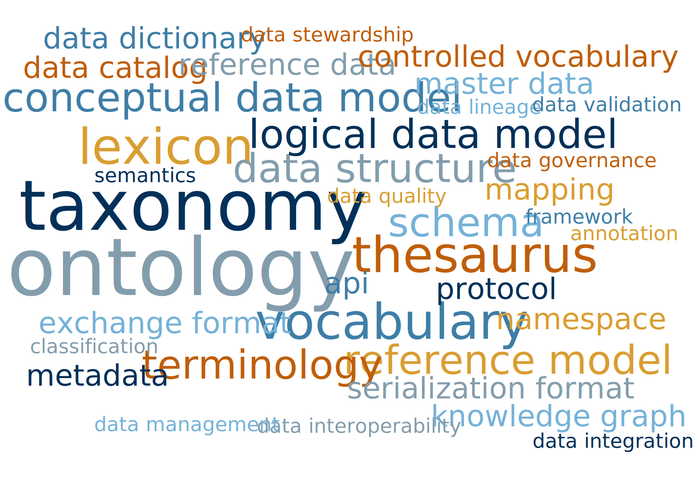

# A proof-of-concept ontology for the Swiss agricultural and food sector

Ontology, derived from the Greek words *Onto* (existence or being real) and *Logia* (science or study), is a term that explores the nature of being and existence. In a philosophical context, ontology asks the fundamental questions about what truly exists and what is real. Philosophers use ontology to build theories and models that help them understand the world's foundational components and how they relate to each other. For example, they might ask whether physical objects like shoes are more real than immaterial concepts like walking, or explore the relationship between tangible items and the actions associated with them.

In non-philosophical contexts -- especially in information theory -- ontology takes on a more specialized meaning. Here, it refers to the description of what exists within a specific field, including the relationships and hierarchies between its parts. Researchers focus on naming parts and processes and grouping similar ones into categories, rather than debating their true essence or reality. They aim to systematically organize knowledge within a domain to facilitate understanding and communication.

Ontologies as a concept are somewhat related to **(controlled) vocaularies**, **terminologies**, **taxonomies** and **thesauri**. In the next chapter, we'll look at these terms and at how they are different from each other.

## Collections of words for things

We'll start with a loose collection of terms. Depending on how formalized or specific this collection is, we speak of vocabularies, terminologies or controlled vocabularies.

### Vocabularies

Imagine you have a **vocabulary** as all the words you know or can use. It's like the words in a dictionary -- just a big collection of words. They aren't tied to strict rules about how they should be used.

**Example:** Your vocabulary might include words like "field", "tractor", "farmer", or "crop".

### Terminologies

When you focus on a specific area, like farming or agriculture, you start using special words that have more precise meanings. This is what we call a **terminology**. It's a set of important words for that field, and these words are carefully defined so that people working in agriculture know exactly what they mean.

**Example:** In agriculture, "irrigation" means the system or process of applying controlled amounts of water to plants. The term is part of agricultural terminology.

### Controlled vocabularies

Now, let's say you want to make sure that everyone in farming uses the exact same words in the same way. This is where a **controlled vocabulary** comes in. In a controlled vocabulary, not only are the words specific, but they are also controlled by rules. These rules make sure that no one uses synonyms or alternative words, and everyone sticks to the same exact terms. Hence, they are often used in IT-systems.

**Example:** A *Sömmerungsbetrieb* is a well defined term in the agricultural terminology ordonance (*Landwirtschaftliche Begriffsverordnung*). A controlled vocabulary wouldn't allow the use of terms such as *Alpbetrieb* to express the same thing.

## Adding relationships between terms

Once we start drawing relationships between the terms we no longer only have vocabularies or terminologies, but we start having taxonomies, thesauri or even ontologies.

### Taxonomies

We from a terminology or controlled vocabulary into a **taxonomy**. A taxonomy arranges these terms into a structured hierarchy, usually with `is_a` relationships. This helps categorize the terms and show how they relate to each other in a tree-like structure.

**Example:** In agriculture, we might create a taxonomy of crops. We could start with a broad category like "crops," which is then divided into subcategories like "cereals", "vegetables", "fruits", etc. Under "fruits," you could further classify specific types like "apples", "oranges", and "bananas".

### Thesauri

A **thesaurus** goes beyond just hierarchical relationships. It not only includes the terms and their definitions but also captures different types of relationships between the terms. A thesaurus can show **synonyms**, **related concepts**, and even **broader** or **narrower** terms.[^readme-1]

[^readme-1]: Note that these relationship come from SKOS, while the more strict classification terms in a taxonomy are more aligned with OWL.

**Example:** In an agricultural thesaurus, the term "pesticide" might be connected to related terms like "herbicide", and "fungicide". It could also list synonyms, such as "plant protection products", and show related terms like "integrated pest management". This helps users find terms that are connected, even if they aren't hierarchically related.

While a taxonomy is about organizing terms into a strict categories with a hierarchical structure, the thesaurus is more flexible and shows how different terms are connected through various relationships.

### Making the jump to ontologies

An ontology takes things even further than terminologies, taxonomies, and thesauri. While a terminology lists terms, a taxonomy organizes them into categories, and a thesaurus maps synonyms and related concepts, an ontology defines a **formal structure of concepts and their relationships** using **logical rules**. This allows machines to understand and reason with the data by modeling how concepts interact and behave in a particular field.

**Example:** An ontology might include terms like "crop rotation", "soil fertility", "legumes", and "nitrogen fixation". In addition of what thesauri and taxonomies do, it would also define relationships such as "legumes increase nitrogen levels in the soil", and "crop rotation with legumes improves soil fertility”. By formally defining these relationships, an ontology enables complex reasoning and querying. For instance, it can help answer questions like "Which crops naturally enhance soil nitrogen?"

## What is the difference between ontologies and knowledge graphs?

Knowledge graphs are closely related to ontologies. To better understand the separating line, we’ll have to understand the distinction between **objects** and **concepts**. The difference is not neat, but generally, some elements are called concepts because they usually represent abstract objects and not specified, real-world concepts. For example, the concept *cow* (`http://aims.fao.org/aos/agrovoc/c_1939`) does not represent a specific cow, but rather the general category of cows (Stellato, [2012](https://doi.org/10.1016/S2095-3119(12)60060-4)). While knowledge graphs (may) include objects and their relationships, ontologies only include concepts and their relationships.

# One-sentence description of (somewhat) related concepts

| **Concept** | **Description** |
|:-----------------|:-----------------------------------------------------|
| **Terminology** | The set of terms used in a particular domain or context. |
| **Thesaurus** | A collection of terms and their synonyms used for improving language search or clarity. |
| **Taxonomy** | A structured classification system organizing concepts into hierarchical categories. |
| **Hierarchy** | A system where items are ranked according to levels of importance or authority. |
| **Vocabulary** | The set of words and terms used in a language or field. |
| **Controlled vocabulary** | A standardized set of terms and definitions used for consistent information management. |
| **Lexicon** | The vocabulary of a language, discipline, or domain. |
| **Data Model** | An abstract model that defines how data is structured and related. |
| **Exchange Format** | The agreed format used for transferring data between systems. |
| **Schema** | A blueprint or structure that defines how data is organized and validated. |
| **Metadata** | Data that describes other data, providing context or additional details. |
| **Classification** | The process of organizing items into categories or groups based on shared characteristics. |
| **Mapping** | The process of linking concepts or data points from one system to another. |
| **Semantics** | The meaning or interpretation of words and symbols within a specific context. |
| **Reference Model** | An abstract framework for understanding or describing the relationships among components. |
| **Conceptual Model** | A representation of concepts and their relationships within a system or domain. |
| **Logic Model** | A visual or narrative depiction of the relationships between activities, outputs, and outcomes. |
| **Standardization** | The process of implementing and developing technical standards to ensure consistency. |
